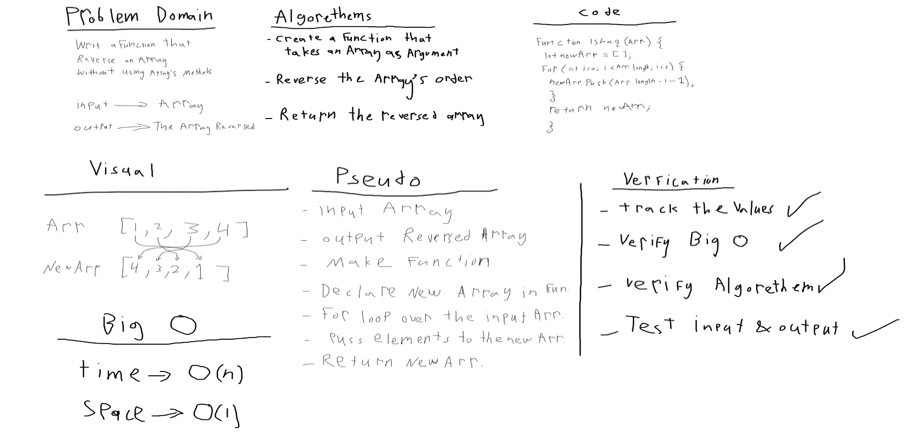
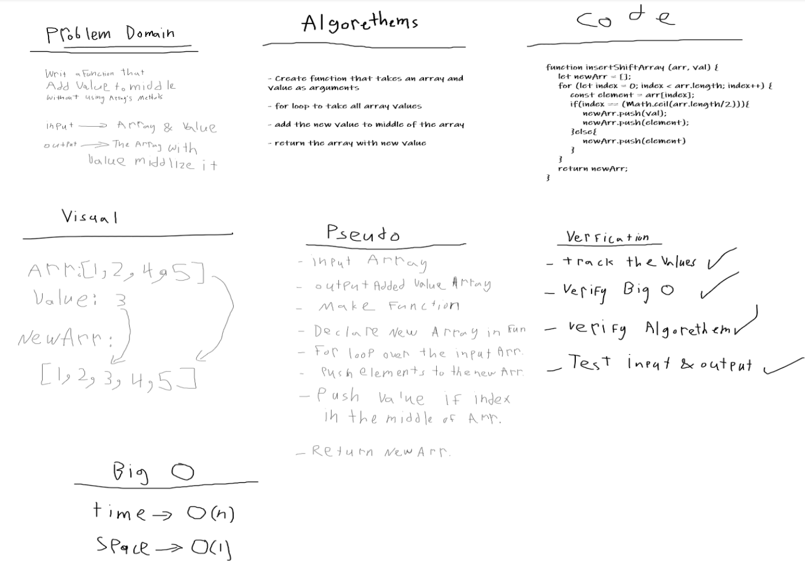

# Data Structures and Algorithms

See [setup instructions](https://codefellows.github.io/setup-guide/code-301/3-code-challenges), in the Code 301 Setup Guide.

## Repository Quick Tour and Usage

# 301 Code Challenges

Under the `data-structures-and-algorithms` repository, at the top level is a folder called `code-challenges`

Each day, you'll add one new file to this folder to do your work for the day's assigned code challenge

### 401 Data Structures, Code Challenges

- Please follow the instructions specific to your 401 language, which can be found in the directory below, matching your course.

# 401 code Challenges

* # Reverse an Array
    One of the array methods.

    ## Challenge
    Without utilizing any of the built-in methods available to your language, return an array with elements in reversed order.
    
    ## Approach & Efficiency
    I user for loop because I can't use any array methods and it was easy.
    
    ## Solution
    

* # Shift an array 
    One of the array methods.

    ## Challenge Description
    Without utilizing any of the built-in methods available to your language, return an array with a value added to middle of it

    ## Approach & Efficiency
    I user for loop & if statement

    ## Solution
    