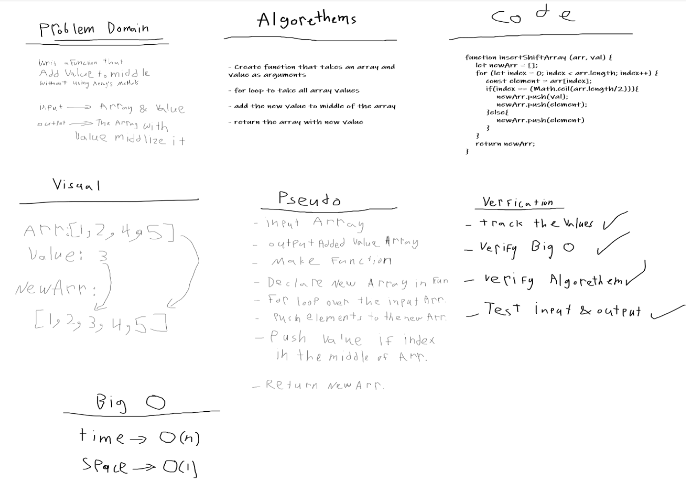

# Shift an array 
One of the array methods.
## Challenge Description
Without utilizing any of the built-in methods available to your language, return an array with a value added to middle of it
## Approach & Efficiency
I user for loop & if statement
## Checklist
- [x] New Branch
- [x] insertShiftArray function
- [x] Don't use built in methods
- [x] Draw a whiteboard
- [x] Update readme file
- [x] Create a test
## Solution
