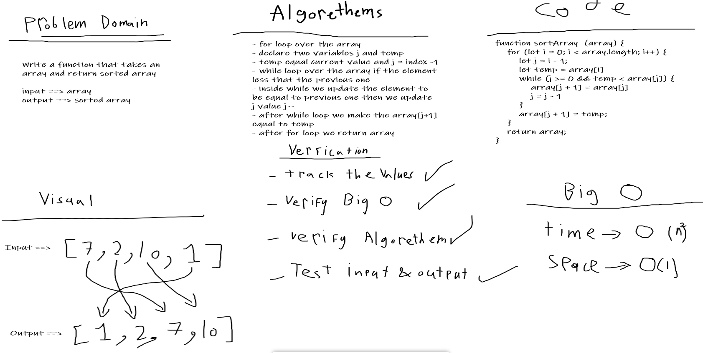

# Sort an Array
One of the array methods.
## Challenge
Without utilizing any of the built-in methods available to your language, return an array with elements in sorted.

## Approach & Efficiency
I used nested loop because I can't use any array methods and it was easy.
## Checklist
- [x] New Branch
- [x] reverseArray function
- [x] Don't use built in methods
- [x] Draw a whiteboard
- [x] Update readme file
- [x] Create a test
## Solution
