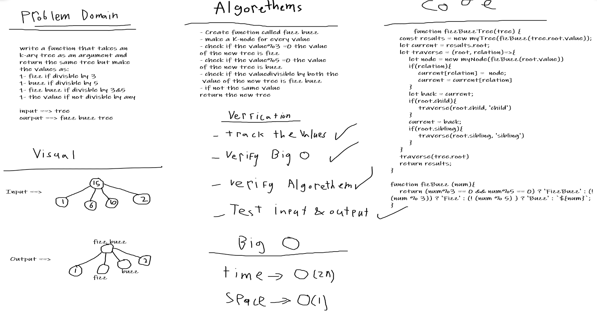

# K-ary Trees
One of the data structures.
## Challenge
- Create fizz buzz function

## Approach & Efficiency
I used classes and it was hard.
## Checklist
- [x] New Branch
- [x] create classes
- [x] Update readme file
- [x] Create a test
- [x] Net, clean and flexable code
- [x] Add all needed methods

## Solution

