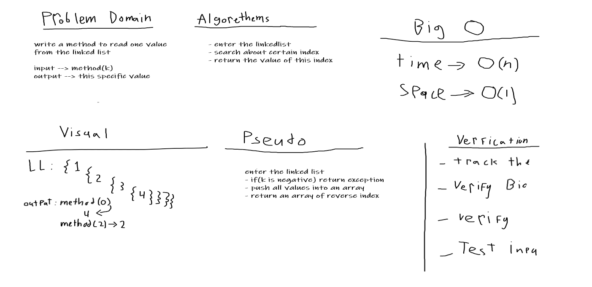

# Linked List
One of the data structures.
## Challenge
create a method to create a linked list
create a method to insert before or after the linkedlist
create a method to read from the last of linked list

## Approach & Efficiency
I used classes and it was easy.
## Checklist
- [x] New Branch
- [x] create classes
- [x] Update readme file
- [x] Create a test
- [x] Net, clean and flexable code
- [x] Add all needed methods

## Solution

