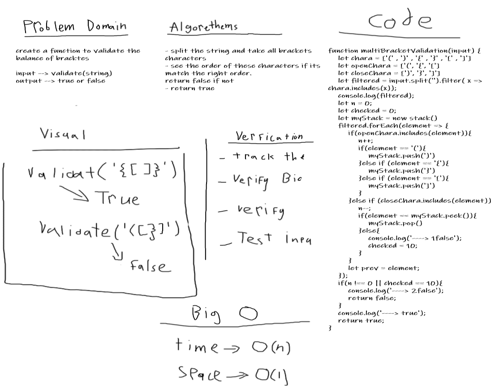

# Multi Brackets Validation

## Challenge
Validate if the brackets in the string are balanced.

## Approach & Efficiency
I used functions & stacks.
## Checklist
- [x] New Branch
- [x] create classes
- [x] Update readme file
- [x] Create a test
- [x] Net, clean and flexable code
- [x] Add all needed methods

## Solution
