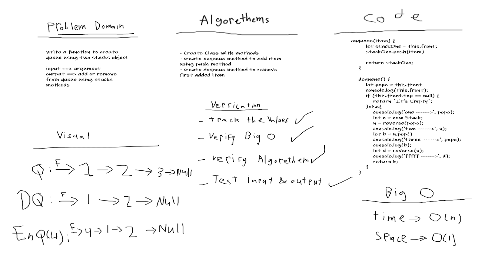

# Stacks & Queues
One of the data structures.
## Challenge
Create methods to enqueue & dequeue to queue using two stacks.

## Approach & Efficiency
I used classes and it was easy.
## Checklist
- [x] New Branch
- [x] create classes
- [x] Update readme file
- [x] Create a test
- [x] Net, clean and flexable code
- [x] Add all needed methods

## Solution
