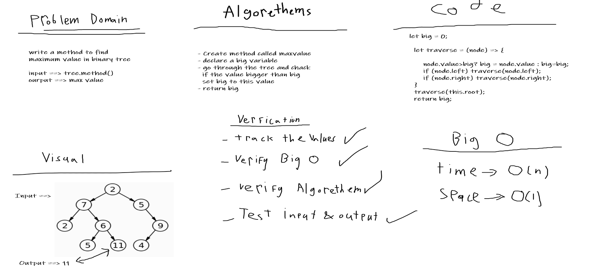

# Trees
One of the data structures.
## Challenge
- Create methods to read the Tree and add to binary search and check if tree contain a value.
- Create methods to find max value in the binary tree

## Approach & Efficiency
I used classes and it was easy.
## Checklist
- [x] New Branch
- [x] create classes
- [x] Update readme file
- [x] Create a test
- [x] Net, clean and flexable code
- [x] Add all needed methods

## Solution

