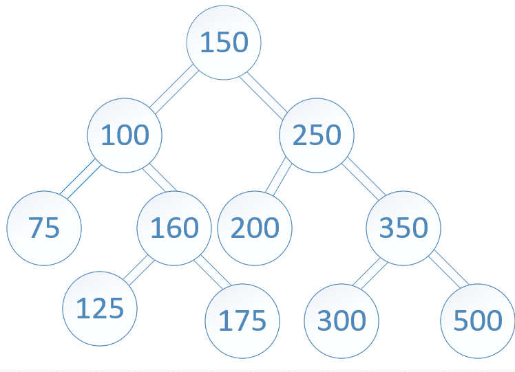

# InterSection
### Code
```
function tree_intersection(tree1, tree2){
let first = tree1.root;
let second = tree2.root;
const results = [];
let traverse = (node1 , node2) => {
     if(node1.value == node2.value) results.push(node1.value);
    if (node1.left && node2.left) traverse(node1.left, node2.left);
    if (node1.right && node2.right) traverse(node1.right, node2.right);
}
traverse(first, second)
return results;
}
```
### Algorethems
- go through the two trees.
- if the value of current node is the same in the trees push it to the array
- traverse left then right
- return the array

### Complexity
* time: O(n)
* space: O(1)

### Trace
tree1: 
tree2: 
results: [] //[100]//[100,160]//[100,160,125]//[100,160,125,175]//[100,160,125,175,200]//[100,160,125,175,200,350]//[100,160,125,175,200,350,500]

***return results***